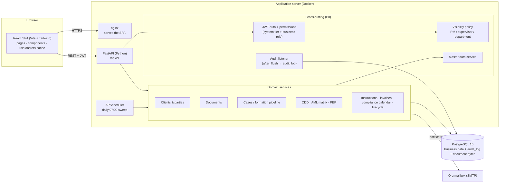

# Triam CRM — Architecture

Status: updated for P0 Foundations (4 Oct 2026). Answers BRD §20 "Architecture diagram — to be prepared".

## Components

## Request lifecycle
1. The browser calls `/api/v1/...` with a JWT.
2. `get_current_user` resolves the user, then stamps the user and IP on the request's DB session (`set_actor`).
3. Permission checks run (`require_roles` for the system tier, `require_permission` for BRD §15 flags).
4. The service applies the visibility policy (`access_control`) to every client and case query.
5. On commit, the audit listener writes one `audit_log` row per created, updated or deleted audited record, with field-level before/after values.

## Access model (BRD §15)
| Layer | What it controls |
|---|---|
| System tier `users.role` (admin / rm / ops / screening) | Which screens and actions exist for the user (unchanged from v1) |
| Business role `roles` (CO, MLRO, Dy MLRO, RO, FO, Sales Manager, …) | Extra permission flags: `client.approve`, `document.delete_submitted`, `master.manage`, `audit.view`, `view.all_clients`, `view.department_clients` |
| Supervisor chain `users.supervisor_id` | A supervisor sees everything their direct and indirect reports see |
| Client assignment (Anchor RM, Non-anchor RMs, creator) | Which clients an RM sees |

## Hosting (BRD §20)
Initial: six months on the vendor server with daily DB backups (weekend backups retained). Later: AWS/Azure, subject to approval. SharePoint hosting is under review.
