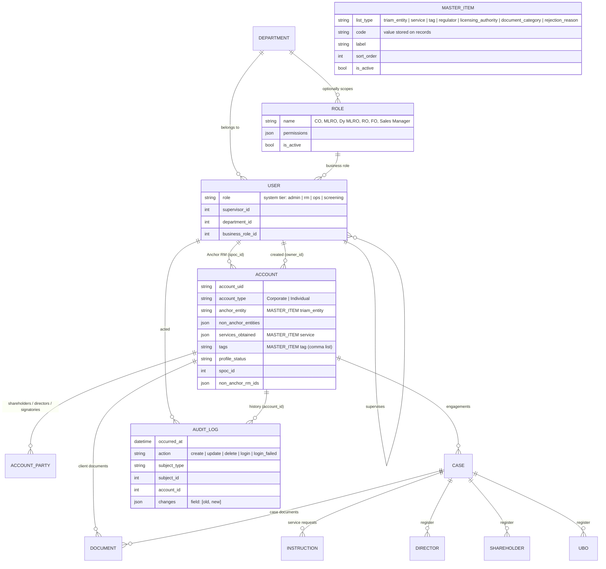

# Triam CRM — Data Model (core entities)

Status: updated for P0 Foundations (4 Oct 2026). Answers BRD §20 "Data relationships / ER diagram — to be prepared". This shows the core client-centric entities; supporting tables (formation, compliance schedule, lifecycle, AML assessments, PEP, invoices, notifications…) hang off `CASE`.

Master values are stored by **code** and referenced by convention (no foreign key), so deactivating an item never breaks old records. Validation of new values happens in the service layer.
